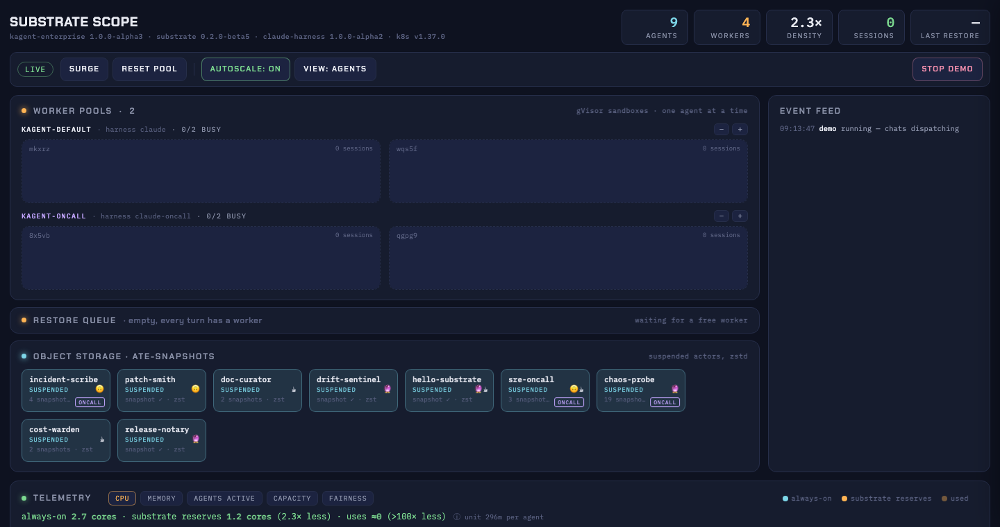

# kagent-enterprise + Agent Substrate

A lab and a live demo for **kagent-enterprise** on **Agent Substrate**:

- `deploy/`: one script makes a kind cluster, installs Substrate and
  kagent-enterprise, and makes 9 Claude Code agents on two worker pools.
- **Substrate Scope** (`server.mjs`): a live board that shows these agents as
  snapshot-backed actors in gVisor sandboxes, not as always-on pods. The
  board shows restores, queueing, autoscaling, isolation, and the CPU and
  memory saved.

This is the enterprise port of
[substrate-scope](https://github.com/themsquared/substrate-scope) (OSS kagent
0.10 + Substrate 0.0.9). The board is the same; the data path underneath is
new, because kagent-enterprise is a different API.

| Version pin | |
| --- | --- |
| kagent-enterprise | `1.0.0-alpha3` |
| Agent Substrate | `0.2.0-beta5` |
| Harness image | `claude-harness:1.0.0-alpha2` (by digest) |
| Kubernetes | 1.37, with `certificates.k8s.io/v1beta1` on |



## Quickstart

Requirements: Docker (8 GB free), `kind` >= 0.32, `kubectl`, `helm`, `jq`,
`openssl`, node >= 18, and an Anthropic API key in a file.

```bash
git clone https://github.com/themsquared/kagent-enterprise-substrate.git
cd kagent-enterprise-substrate
./deploy/install.sh
```

This takes about 10 minutes. The script makes the kind cluster `kagent-ent`,
installs Substrate and kagent-enterprise, and makes 9 agents on two
WorkerPools (refer to [Two worker pools](#two-worker-pools)). Set
`SOLO_LICENSE_KEY` to license the install; without it, the controller logs a
license warning and continues to operate. Set `ANTHROPIC_KEY_FILE` if the key
is not in `~/.anthropic_key`.

```bash
KUBE_CONTEXT=kind-kagent-ent node server.mjs --live
```

Open the board at http://localhost:8123, and the kagent-enterprise UI at
http://localhost:8001. Scope port-forwards both.

To put load on the board (each turn is a real Claude Haiku call; `--budget`
limits the cost):

```bash
node stimulate.mjs --budget 400 --load 0.5
```

## Demo content for the kagent UI

```bash
node deploy/seed-demo.mjs            # once, with Scope running; --fresh to replace
```

This fills the pages of the kagent-enterprise UI that are empty on a new
install:

- **Chats:** 4 named conversations with real content: *Incident · EU
  checkout 5xx* (sre-oncall), *Postmortem* (incident-scribe), *Capacity
  review* (cost-warden), and *Release notes · 4.13* (release-notary).
- **Snapshots:** 6 named checkpoints at important turns (for example "before
  mitigation" and "after rollback").
- **Forks:** *What-if · rollback blocked* is forked from the "before
  mitigation" checkpoint. It is a second actor that starts from that saved
  runtime and continues in a different direction.

The **Prompts** page shows the libraries in `deploy/prompts.yaml`
(`sre-playbooks`, `house-style`) and the `kagent-builtin-prompts` library of
the chart. Each agent's instructions are made from fragments of these
libraries with `{{include "alias/key"}}`. Thus a change to one fragment
changes each agent that uses it. The change makes a new revision, so do it
between demos.

## MCP tools (deliberately useless)

Three small MCP servers give the agents tools to call, so each trace in
Tracing shows a full tree:
*Agent → LLM → Tool → Tool → LLM*, with each `execute_tool` span and the
token count of the turn.

| Server | Tools | Bound to |
| --- | --- | --- |
| `oracle` 🔮 | `ask_the_oracle` (a Magic 8-Ball for ops), `roll_dice` | chaos-probe, release-notary, drift-sentinel, hello-substrate |
| `coffee` ☕ | `brew`, `bean_level` (on-call morale index) | sre-oncall, cost-warden, doc-curator, hello-substrate |
| `excuses` 🙃 | `generate_excuse`, `blame_dns` (it is always DNS) | sre-oncall, incident-scribe, patch-smith |

The three servers are one file, [`mcp/server.mjs`](mcp/server.mjs). The
file uses the Streamable HTTP transport with JSON responses and has no
dependencies. It runs on the stock `node:22-alpine` image from a ConfigMap,
so there is no image to build. `deploy/mcp.yaml` registers each server as a
`RemoteMCPServer` (the kagent UI's MCP Servers page shows 3 servers and 6
tools). Each AgentTemplate binds its servers under `spec.tools`. The server
reference must not have `apiGroup` (`kind: RemoteMCPServer`, `name` only).

Validated: an agent in its gVisor sandbox calls the in-cluster servers through
the Substrate network (the server logs show each call and its arguments). To
make traffic with tool calls, use prompts that start with "Use your tools:".
`stimulate.mjs` sends some of these prompts.

## Two worker pools

The fleet runs on two WorkerPools, which isolates one group of agents from
the load of the other group:

| Pool | Harness | Agents |
| --- | --- | --- |
| `kagent-oncall` | `claude-oncall` | `sre-oncall`, `incident-scribe`, `chaos-probe` |
| `kagent-default` | `claude` | the other 6 |

A Harness selects its agents with a label (`scope.demo/pool: oncall` or
`general`), and the two selectors do not overlap. The Harness puts its agents
on its pool with `spec.substrate.workerPoolRef`. To move an agent, change its
label. The agent then gets a new golden snapshot on its new pool.

Scope operates each pool independently:

- The board shows one row of bays for each pool, with its busy count and its
  own +/- buttons.
- Admission is first in, first out within a pool and independent across
  pools. A backlog on `kagent-default` does not delay a turn for an on-call
  agent.
- The autoscaler scales each pool on the demand of that pool only.

Validated on the live cluster: with `kagent-default` full (3 workers busy, 9
turns in the queue), `sre-oncall` went to an idle `kagent-oncall` worker
immediately and replied.

## The kagent-enterprise dashboard

The kagent UI home page (:8001) has Substrate runtime panels: cold-start
rate, activation p95 against the 1s SLO, assigned and idle workers per pool,
desired and ready workers, crash reasons, image cache hit ratio, and cost per
agent instance. These panels show data only when Substrate exports OTLP to
the enterprise telemetry collector. The #191 procedure does not do this step.
`deploy/substrate-values.yaml` sets it:

```yaml
otel:
  endpoint: http://solo-enterprise-telemetry-collector.kagent.svc.cluster.local:4317
```

If this value is not set, each Substrate component sends to
`localhost:4317`, the connection is refused, and all the Substrate panels are
empty.

Scope deletes its agent sessions when it stops (Ctrl-C), and deletes sessions
left by an earlier run when it starts. Thus the "Cost per Agent Instance"
table shows only current sessions.

## Telemetry: how the value prop is measured

The CPU and Memory charts compare three lines, and the legend shows a live
"now:" line with the ratios:

- **always-on**: the number of agents × unit. This is what the fleet reserves
  if each agent is an always-on pod.
- **reserved**: the number of pool workers × unit. Each worker must be able to
  hold one running agent.
- **actually used**: the measured CPU and memory of the worker pods. Suspended
  agents are snapshots, so they use no worker memory.

The **unit** is measured. It is not a guess. No object in the cluster declares
resources (the worker pods and the ActorTemplates have no requests), so Scope
uses the p95 footprint of a worker that ran an agent during a stats window.
On this rig, one Claude Code agent is approximately 350m CPU and 270–300Mi
memory. The gVisor sandbox is in the worker pod cgroup (its memory file shows
as `shmem`), so the pod working set includes the agent. Scope keeps the
measured unit per context in `$TMPDIR`, so that a restart does not show the
placeholder. The legend always shows the unit and its source.

The kubelet refreshes pod stats only every 12–18s, which is longer than a
Claude turn. Thus the CPU line uses the cumulative `usageCoreNanoSeconds`
counter, not the instantaneous rate. The counter includes all the CPU time of
a turn, also when the turn completes between two refreshes.

The figures for the 9-agent fleet, measured at idle on this rig:
**2.3× less reserved, 11× less memory in use**. When the fleet is full
(each agent has a worker), the reserved figure is the same as always-on, but
the used figure stays much lower. The autoscaler never gives a pool more
workers than it has agents. The reserved ratio is agents ÷ idle workers. Thus
the ratio increases with the size of the fleet: idle agents cost only snapshot
storage.

## What changed from the OSS edition

| OSS kagent 0.10 | kagent-enterprise alpha3 |
| --- | --- |
| `SandboxAgent` CRD | `AgentTemplate` + `Harness`. The fleet runs on the `claude` and `claude-oncall` Harnesses. |
| REST `/api/substrate/status` | gRPC-Web `SystemService/ListSubstrateWorkers`, `ListSubstrateActors`, `GetSubstrateSummary` |
| One session actor for each chat contextId | One actor `ai-<id>` for each **AgentInstance**. Scope keeps a small pool of instances for each agent, and replaces an instance after 12 turns. |
| JSON-RPC `message/send` | A2A 1.0 `lf.a2a.v1.A2AService/SendStreamingMessage`, routed by the `x-kagent-agent-instance-id` header |
| Sessions API ingest | `ListAgentInstances` + A2A `ListTasks` |
| A full pool rejects immediately ("no free workers") | A full pool times out the request (see Known issues). Scope admits a turn only when a worker is free. |
| No auth | Bearer token from the bundled autoauth IdP, or `KAGENT_TOKEN` |

kagent-enterprise has no gRPC reflection and no JSON transcoding. Thus Scope
carries a message schema, [`lib/schema.json`](lib/schema.json), that
[`tools/gen-schema.py`](tools/gen-schema.py) extracts from the release
artifacts: the descriptors in the controller binary, and the A2A descriptor in
the UI bundle. [`lib/grpcweb.mjs`](lib/grpcweb.mjs) is a gRPC-Web client with
no dependencies that uses that schema. For a new kagent-enterprise release, do
the script again:

```bash
python3 tools/gen-schema.py \
  us-docker.pkg.dev/solo-public/kagent-enterprise/kagent-enterprise-controller:<ver> \
  <path-to-ui-index.js> > lib/schema.json
```

## The demo beats

1. **The pods do not show the agents.** Do `kubectl get pods -n kagent`: you
   see 4 worker pods, 2 in each pool. The board shows 9 agents, and all of
   them are snapshots in storage.
2. **Watch one agent operate.** Click a chip. The drawer shows the prompt, the
   restore onto a worker, the reply and its latency, and the checkpoint. Type
   in the drawer: your message causes a real restore.
3. **The kagent UI is on the same board.** Chat with an agent at :8001. The
   prompt and the reply show in the Scope drawer, with the identity of the
   user (`obo`).
4. **Overload it.** Click SURGE: 6 turns go to the 2 `kagent-default` workers
   and 3 turns go to the 2 `kagent-oncall` workers. The queue fills, and
   AUTOSCALE adds workers to each pool to agree with the demand of that pool.
   When the demand stops, the pools decrease again.
5. **Isolation.** While SURGE fills `kagent-default`, talk to `sre-oncall`. It
   goes directly to its own pool, and the backlog does not delay it.
6. **The platform view.** Open the kagent UI home page. It shows the same
   run as cold-start rate, activation p95, and occupancy for each pool.
7. **The cost chart.** Telemetry → CPU: the dotted line is what 9 always-on
   pods reserve. The amber line is what the pool reserves.

## Before a customer demo

```bash
./deploy/preflight.sh          # add --fix to reset a stuck pool
```

The script checks each failure that this rig had: CPU starvation from
other clusters, a controller that restarted recently, templates not Ready on
their current revision, actors stuck in `Resuming`, stale port-forwards, and a
real turn. **Do not do `helm upgrade` or change the fleet during a demo.** A
controller restart causes new golden snapshots, makes the cached tokens
invalid, and can stop an actor in `Resuming`. Scope now recovers from all
three (it gets a new token, restarts the port-forward, and replaces a stuck
worker pod), but you see the recovery on stage.

## Known issues (alpha3, found while building this)

- **A resume can stop in `Resuming`.** If a controller restart (for example a
  `helm upgrade`) occurs during a resume, the actor stays `Resuming` and keeps
  its worker. The golden snapshots for the new revision then wait for a free
  worker, so the pool stops. `CancelTask` does not release the worker. Only a
  new worker pod releases it. Scope's watchdog replaces a worker pod if an
  actor stays `Resuming` for 90s (`RESUME_STUCK_MS`), and **RESET POOL** now
  restarts the worker Deployments. The affected sessions go to `Crashed`, and
  Scope stops using them.
- **Claude's `call_llm` spans can stop.** If they stop, Tracing shows each
  turn with "—" for Model and Tokens, and a trace has only `POST` and
  `invoke_agent`. On this rig the spans stopped for about 18 hours. They
  started again after these changes: `otel.logging.enabled` (in
  `deploy/values.yaml`, not in #191) and new golden snapshots when the MCP
  tools were bound. We did not find the exact cause. A delayed flush at
  suspend is not the cause (tested). `preflight.sh` now checks that the last
  turn has `call_llm` spans. #191 says that its tracing sections are "not
  verified in this revision". With logging on, Claude's
  `claude_code.api_request` logs (model, tokens, cost, TraceId) arrive in
  ClickHouse also when the spans do not.
- **The controller's own version reports `dev`.** Scope reads the chart label
  instead.
- **The Substrate chart does not configure OTLP for all components.**
  `otel.endpoint` reaches ate-api, ate-controller, atelet and atenet-router,
  but not `atenet-egress` or `k8s-credential-provider`. Those two send to
  `localhost:4317`.

- **An oversubscribed send does not queue.** If no worker is free, the send
  fails after approximately 5s with `INTERNAL: actor "ai-…" request timed
  out`. The task stays `SUBMITTED`, and the resumed actor keeps its worker
  and does not suspend. Thus the pool can lock. Scope prevents this with
  admission control. A watchdog cancels orphaned tasks (a `SUBMITTED` task
  whose actor is `RUNNING`), and **RESET POOL** cancels all open tasks. After
  `CancelTask`, the actor suspends.
- **After a key rotation, the old key stays in use.** The egress gateway
  caches credentials. After you change the `kagent-anthropic` Secret, restart
  `deploy/k8s-credential-provider` and `deploy/atenet-egress` in `ate-system`.
  `install.sh` does this.
- **A bad key does not fail fast.** Claude Code retries an invalid key for
  approximately 60s, and then the turn fails with
  `Invalid API key · Fix external API key · Harness runtime execution failed`.
- **CPU starvation causes restart cascades.** If the Docker VM is shared with
  other clusters, a scale-up to 8 gVisor workers can make the probes time
  out. Then `ate-api-server` restarts, restores fail with `UNKNOWN`, and some
  instances keep a lifecycle operation that stays pending ("is pending;
  runtime effects may be unresolved"). You cannot delete those instances.
  Before a demo, stop the other clusters, or set `SCOPE_MAX_WORKERS` to a
  lower value.
- **An agentgateway license is not accepted.** The controller logs
  `reason: MissingFromKey` if the key does not include kagent-enterprise.

## Configuration

| Env | Default | |
| --- | --- | --- |
| `KUBE_CONTEXT` | current context | Scope sends all kubectl calls and port-forwards to this context only |
| `SCOPE_MAX_WORKERS` | `8` | Maximum number of workers for each pool, for the autoscaler and the +/- buttons |
| `KAGENT_TOKEN` | autoauth | Bearer token for an OIDC cluster |
| `KAGENT_API` / `KAGENT_UI` | port-forwards | Controller :8083 and UI :8080 addresses, if you give them |
| `ATESPACE` | `kagent` | Atespace to monitor |
| `UNIT_CPU_M` / `UNIT_MEM_MI` | ActorTemplate limits, or 50m/128Mi | Resources reserved for each always-on agent pod, for the cost chart |

HTTP endpoints: `GET /events` (SSE), `GET /agents`, `POST /converse {agent,
text}` (one turn; the response comes when the turn completes), `POST /chat`,
`POST /surge`, `POST /scale {pool, replicas}`, `POST /reset`, `POST /autoscale
{on}`, `POST /demo {run}` (the switch that stops all billable traffic).

## License

Apache-2.0
